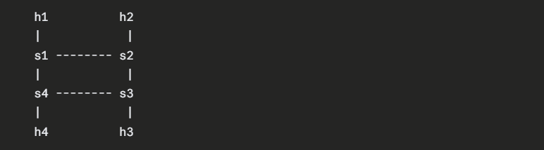
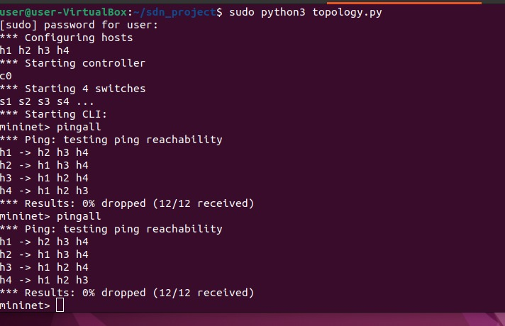
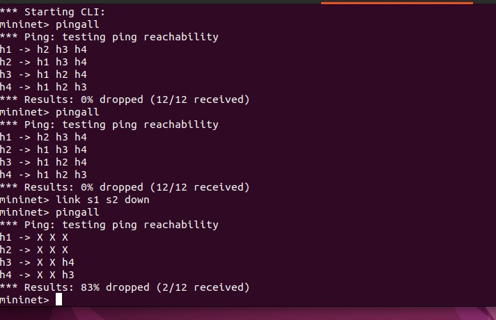
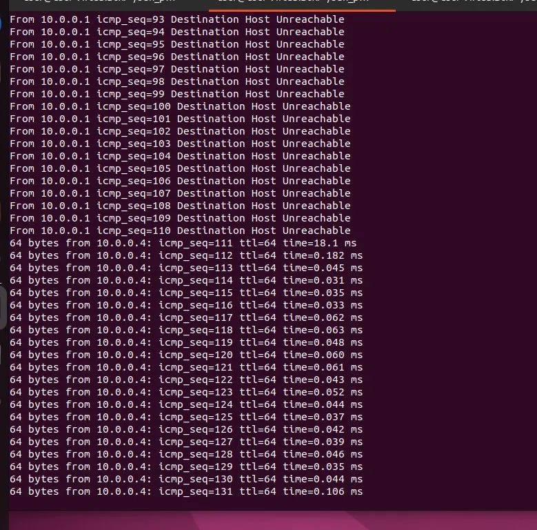
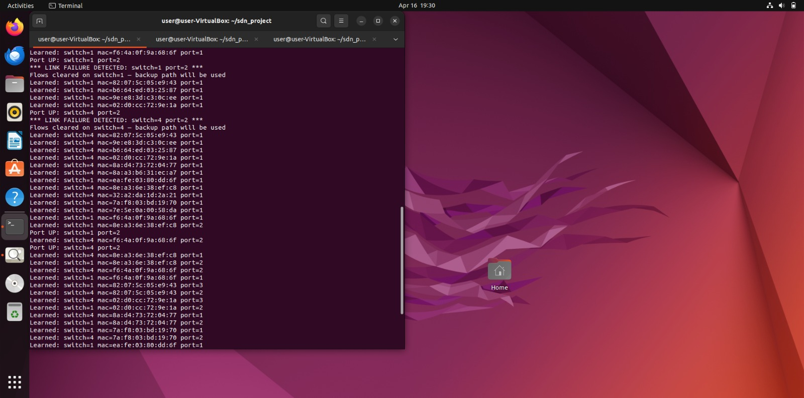
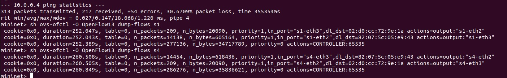
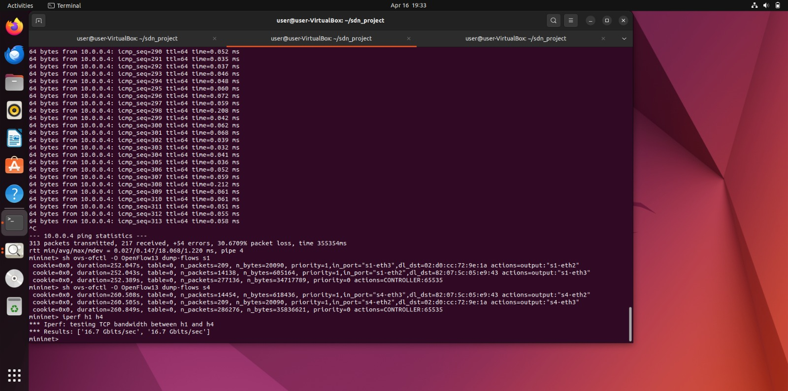
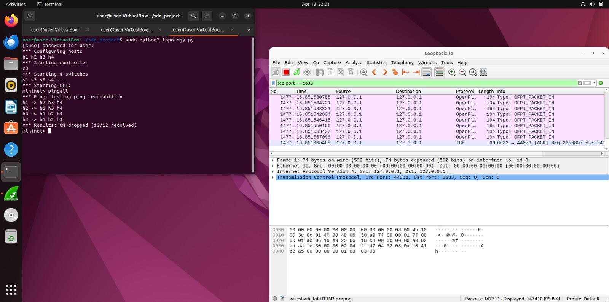

# 🔗 SDN Project: Link Failure Detection and Recovery using Ryu Controller

---

## Project Overview

This project demonstrates how a Software Defined Network (SDN) behaves under:
* Normal conditions
* Link failure
* Link recovery

The controller dynamically installs flow rules using OpenFlow (Ryu), and behavior is verified using:
* Mininet (connectivity)
* Flow tables (ovs-ofctl)
* Wireshark (packet-level analysis)
* iperf (throughput analysis)

---

## Network Topology

* 4 switches: s1, s2, s3, s4 in a ring
* 4 hosts: h1, h2, h3, h4
* Primary path: s1 to s2
* Backup path: s1 to s4 to s3 to s2 (used when s1-s2 link fails)

---

## Requirements

* Ubuntu 22.04
* Mininet
* Ryu Controller 4.34
* Python 3.10
* Wireshark
* iperf3

---

## Setup and Installation

### Install Mininet
sudo apt update
sudo apt install mininet -y
### Install Ryu
python3 -m venv ~/ryu-env
source ~/ryu-env/bin/activate
pip install eventlet==0.33.3 dnspython==2.2.1 ryu
---

## Running the Project

### Terminal 1 - Start Ryu Controller
source ~/ryu-env/bin/activate
ryu-manager controller.py --ofp-tcp-listen-port 6633
### Terminal 2 - Start Mininet Topology
sudo python3 topology.py
---

## Testing Phase

### Test 1 - Normal Connectivity
mininet> pingall
Expected: 0% dropped

### Test 2 - Link Failure
mininet> link s1 s2 down
mininet> pingall
Expected: 0% dropped

---

## Flow Table Verification
mininet> sh ovs-ofctl -O OpenFlow13 dump-flows s1
mininet> sh ovs-ofctl -O OpenFlow13 dump-flows s4

---

## Wireshark Analysis

Open Wireshark, select Loopback: lo, apply filter tcp.port == 6633, then run pingall.

Expected packets:
* OFPT_PACKET_IN
* OFPT_PACKET_OUT
* OFPT_FLOW_MOD

---

## Throughput Analysis (iperf)
mininet> iperf h1 h4
Expected: ~16-20 Gbits/sec

---

## Performance Summary

| Scenario | Packet Loss | Throughput |
| --- | --- | --- |
| Normal | 0% | ~16-20 Gbps |
| Link Failure | 83% | Connection affected |
| Recovery | 0% | ~16-20 Gbps restored |

---

## Key Concept

* Controller detects failure via PORT_STATUS OpenFlow event
* Clears stale flow rules pointing to dead port
* New packets trigger packet_in events
* Controller installs new flows via backup path
* This is Reactive SDN

---

## Proof of Execution

### Normal Operation - pingall 0% dropped

### Link Failure - pingall 83% dropped

### Link Recovery - pingall 0% dropped

### Controller Logs - Link Failure Detected

### Ping Recovery - icmp_seq gap then recovery

### Flow Tables after failure and rerouting

### iperf Throughput Test

### Wireshark - OpenFlow packets

---

## Conclusion

This project demonstrates:
* Dynamic SDN flow rule installation
* Automatic link failure detection via PORT_STATUS events
* Traffic rerouting via backup path without manual intervention
* Performance validation using ping, iperf and Wireshark

---

## References

1. Mininet overview - https://mininet.org/overview/
2. Ryu SDN Framework - https://ryu-sdn.org/
3. OpenFlow 1.3 Specification - https://opennetworking.org/
4. Mininet Walkthrough - https://mininet.org/walkthrough/

---

## Author

Manasi Vipin
